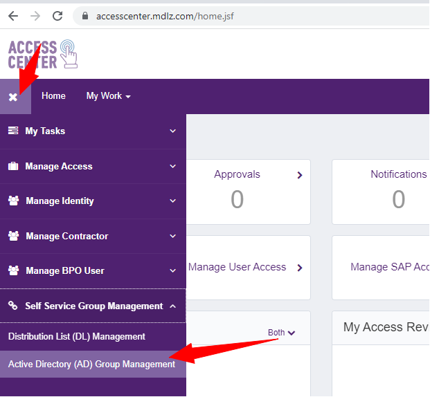
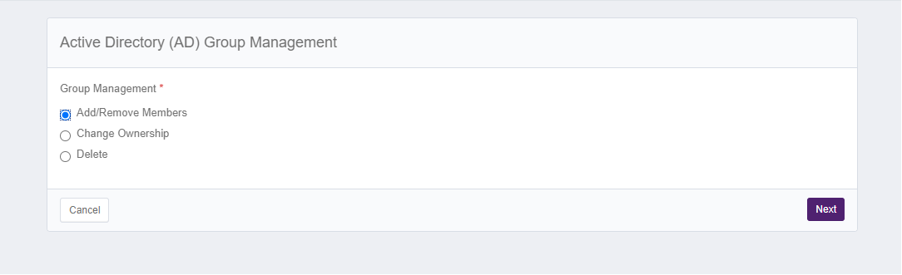
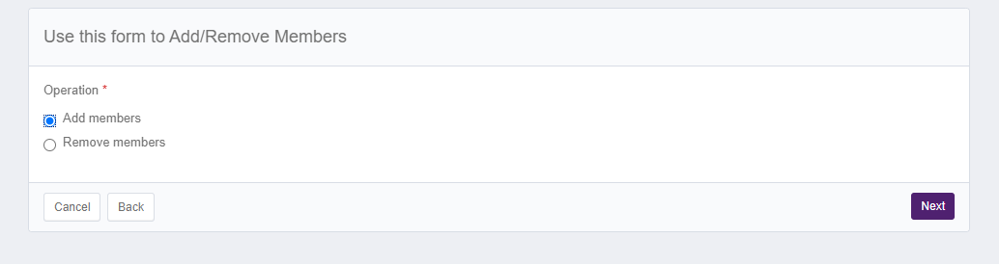
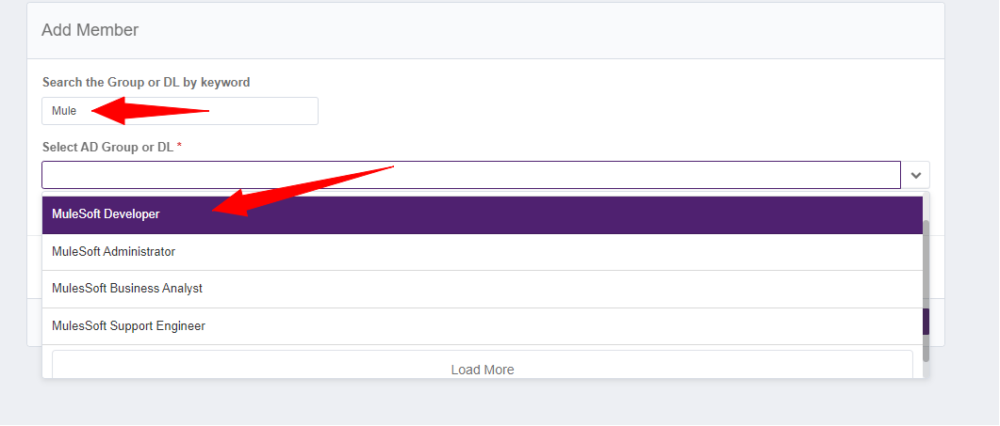
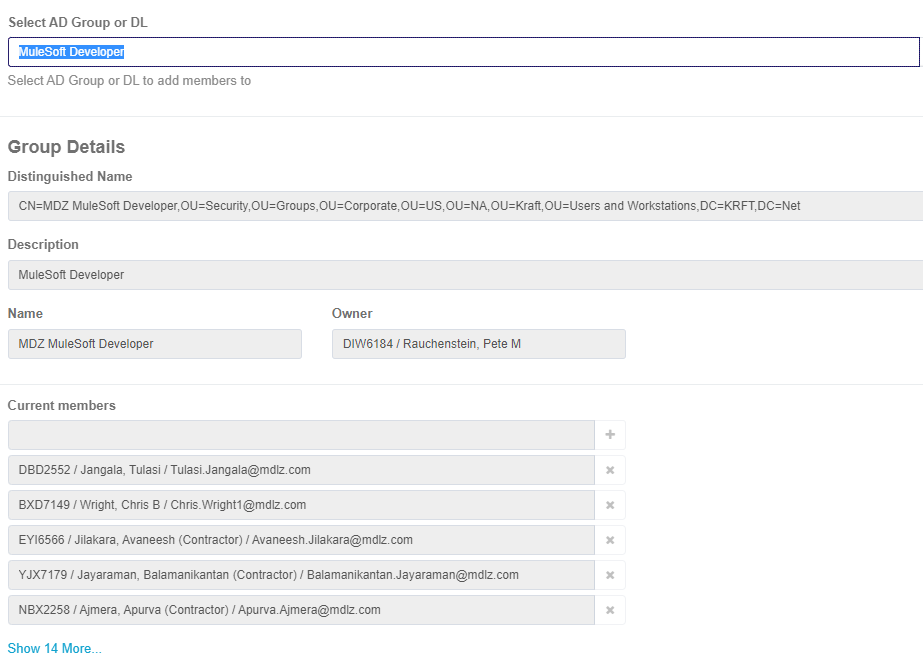
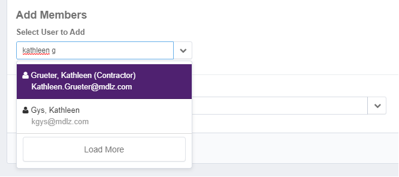

## General Guidelines
_**No local accounts will be provisioned on the MuleSoft platform**._ 

Access to the Mondelez MuleSoft Platform is controlled/governed by existing MDLZ Identity and Access Management processes.  This means that all MuleSoft users (admins, developers, analysts, etc) must:
* **Have a valid MDLZ user account**.  For employees, this account is generated automatically when you are hired.  For Contractors, user accounts are requested and managed through [Access Center](https://accesscenter.mdlz.com/home.jsf).
* **Use the MDLZ Enterprise SSO solution** (PingFederate) to authenticate to the application.   The link to the SSO Logon Page is [https://anypoint.mulesoft.com/login/domain/mdlz](https://anypoint.mulesoft.com/login/domain/mdlz)

* **Use Ping MFA** for multi-factor authentication.   [Click here for details on Ping MFA](https://mdlz.service-now.com/technology?id=itsm_kb_article_view&sys_kb_id=3e900d121b065514009fa60fe54bcb10)

## Requesting Access
Access to MuleSoft can be requested through [Access Center](https://accesscenter.mdlz.com/). The request process is very straightforward and can be started by anyone in the organization with a valid Mondelez User Account.

1. Navigate to [Access Center](https://accesscenter.mdlz.com/home.jsf), expand the navigation menu and select Self-Service Group Management > Active Directory (AD) Group Management.  

2. Select the appropriate options for Adding access.  "Add/Remove Members" and "Add Members".  Click Next to advance.

3. Search for and select the `MDZ MuleSoft Developer` group.  

Once selected, the details of the group will be displayed.  You will see the group owner as well as the current members of the group.  

4.  Scroll down to the "Add Members" section.  Search for the user you wish to add (by name or email address) and ensure they show up in the "Selected Members to Add" list.  

5. Once you have added all users, you can click the SUBMIT button.  
6. You will be taken to a final confirmation screen where you must click "CONFIRM" to complete the submission.

Requests are subject to approval before the user is added. The requester will receive an email when fulfillment is completed.

## Additional Information
More detailed information is available for you once you have been added to this GitHub Organization.  You can view the [private version of this documentation here](https://github.com/mondelez-mulesoft-eng/platform-project-tasks/wiki/MuleSoft-Identity-Management).

